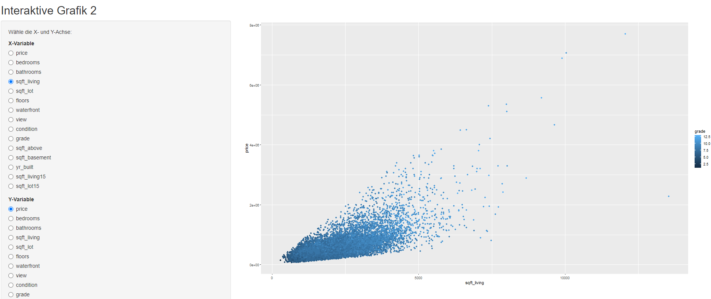

```{r setup, include=FALSE}
knitr::opts_chunk$set(echo = FALSE)
library(flexdashboard)
library(ggplot2)
library(DT)
library(plotly)
library(dplyr)
```

# Aufgabe
**Aufgabe und Daten**

  
-  Für alle Projekte sind grundsätzlich alle Data Science-Phasen vorgesehen:
      
-  Datenaufbereitung und Explorative Datenanalyse, speziell Visualisierung [20%]
      
-  Modellierung (Klassifikation oder Regression) mit zumindest 3 Methoden, inkl. Parameter Tuning und Benchmarking [30%]
      
-  Deployment des besten Modells mittels Webservice (und Webservice Test) [10%]
      
-  Kurzpräsentation des Projekts/der Ergebnisse mittels Dashboards [10%]
      
-  Zwei Extra-Features - zB neue Methoden, interaktive Visualisierungen [20%]
      
-  Dokumentation und Einhaltung der Projekt-Richtlinien [10%]
    

# Datenvisualisierung

Column {data-width=500}
-----------------------------------------------------------------------

### Hauspreis nach Lage


Column {data-width=500}
-----------------------------------------------------------------------

### Hauspreise nach Baujahr {data-width=450}


### Hauspreis nach Wohnfläche und Zustand {data-width=275}


### Hauszustand nach Baujahren {data-width=275}

                                 


# Modelle {data-orientation=rows}
Column {data-width=500}
-----------------------------------------------------------------------
### Vorgangsweise
  
- Während der explorativen Datenanalyse wurden einige Datensätze gefunden, die nicht für die Analyse geeignet waren.
  
- Es wurde ein Datensatz mit unnatürlich hoher Anzahl an Zimmer (33) und nicht dazu passendem Preis entfernt, da es sich höchstwahrscheinlich um einen Eingabefehler handelt.
  
- Es wurde eine Korrelationsanalyse mittels einer Grafik durchgeführt, anhand derer einige Spalten verworfen wurden, da sie Kopien anderer Spalten darstellen oder nur sehr geringen Beitrag zur Erklärung von 'price' leisten: 'id, date, condition, yr_built, yr_renovated, zipcode, long, lat
  

- Die Daten wurden im nächsten Schritt in Trainings- und Testdaten unterteilt. Danach wurden 3 Modelle erstellt, die den Preis der Häuser anhand der anderen Variablen hervorsagen sollen. Es wurde ein Lineares-Regressionsmodell, ein Random-Forest-Modell und ein Neurales Netz verwendet.

- Anhand der Testdaten wurden der Root Mean Square Error (Wurzel des erwarteten quadratischen Abstands), *MAE* (Mittlere Absolute Fehler), *R2* Score, sowie *MAPE* (Mittlerer absoluter prozentualer Fehler) verglichen.
  
- Das beste Modell anhand des RMSE ist für diesen Datensatz das Random-Forest-Modell. Trotzdem muss dazu gesagt werden, dass wegen des sehr hohen RSMEs alle drei Modelle als schlecht einzustufen sind.

Column {data-width=500}
-----------------------------------------------------------------------

### Regressionsergebnisse aus dem Training {data-width=250}
                                  RMSE       MAE      MAPE      R2
-----------------------------  -------     -------  -------   -------                                  
Random Forest                   198.735    125.189      26      0.71
Lineare Regression              222.890    150.094      31      0.6
Neural Network                  648.249    539.0219    100    -2.14
-----------------------------  -------     -------  -------   ------- 

###  {data-width=250}
 

# Webservice {data-orientation=rows}

Column {data-width=500}
-----------------------------------------------------------------------
### Webservice{data-width=500}
* Das beste Modell (Random Forest mit 101 Bäumen) wurde anschließend als Web service deployed.
* In Screenshots unten kann man 2 Test API Calls sehen:
  * Ein großes Haus mit vielen Zimmer, im guten Zustand und Grade mit Seeblick würde laut unserem Modell mehr als 2 Millionen US-Dollar kosten.
  * Ein kleiners Haus mit nur 2 Zimmer, im schlechten Zustand und Grade, mit keinem Seeblick würde laut unserem Modell weniger als 300 Tausend US-Dollar kosten.
* Anleitung zum Starten von Web Service:
  1. Starten Sie eine R session, und exekutieren Sie Kommandos in server_start.R
  2. Dadurch wird ein Web Service gestartet mit einem API Endpoint : POST http://127.0.0.1:8080/predict_price
  3. Starten Sie eine weitere R Session und probieren Sie die API aus, indem Sie Kommandos aus client_test.R exekutieren.

  
Column {data-width=500}
-----------------------------------------------------------------------
### Screenshot Vorhersage 1
  

### Screenshot Vorhersage 2
  

# Interaktive Grafiken {data-orientation=rows}

Column {data-width=500}
-----------------------------------------------------------------------
### Interaktive Grafiken
* Als zusätzliche Features wurde 2 interaktive Grafiken eingebaut (die als ShinyApp im Ordner /interactive liegen)
* Mit der ersten Grafik können Häuser dynamisch, anhand ihrer Preisklassen auf einer geograpfisch Karte filriert werden.
* Mit der zweiten Grafik können Korrelationen der dynamisch ausgewählten Merkmale der Häuser beobachtet werden. (Gut geeignet für explorative Datenanalyse)

Column {data-width=500}
-----------------------------------------------------------------------
### Screenshot Interaktive Grafik 1
  

### Screenshot Interaktive Grafik 2
  


