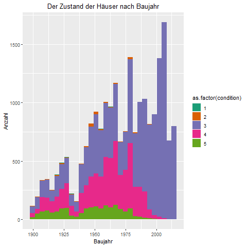

```{r setup, include=FALSE}
knitr::opts_chunk$set(echo = FALSE)
library(flexdashboard)
library(ggplot2)
library(DT)
library(plotly)
library(dplyr)
```

# Aufgabe
**Aufgabe und Daten**

  
-  Für alle Projekte sind grundsätzlich alle Data Science-Phasen vorgesehen:
      
-  Datenaufbereitung und Explorative Datenanalyse, speziell Visualisierung [20%]
      
-  Modellierung (Klassifikation oder Regression) mit zumindest 3 Methoden, inkl. Parameter Tuning und Benchmarking [30%]
      
-  Deployment des besten Modells mittels Webservice (und Webservice Test) [10%]
      
-  Kurzpräsentation des Projekts/der Ergebnisse mittels Dashboards [10%]
      
-  Zwei Extra-Features - zB neue Methoden, interaktive Visualisierungen [20%]
      
-  Dokumentation und Einhaltung der Projekt-Richtlinien [10%]
    

# Grafiken

Column {data-width=500}
-----------------------------------------------------------------------

### Hauspreis nach Lage


Column {data-width=500}
-----------------------------------------------------------------------

### Hauspreise nach Baujahr {data-width=450}


### Hauspreis nach Wohnfläche und Zustand {data-width=275}


### Hauszustand nach Baujahren {data-width=275}

                                 


# Projekt {data-orientation=rows}
Column {data-width=500}
-----------------------------------------------------------------------
### Vorgangsweise
  
- Während der explorativen Datenanalyse wurden einige Datensätze gefunden, die nicht für die Analyse geeignet waren.
  
- Es wurde ein Datensatz mit unnatürlich hoher Anzahl an Zimmer (33) und nicht dazu passendem Preis entfernt, da es sich höchstwahrscheinlich um einen Eingabefehler handelt.
  
- Es wurde eine Korrelationsanalyse mittels einer Grafik durchgeführt, anhand derer einige Spalten verworfen wurden, da sie Kopien anderer Spalten darstellen oder nur sehr geringen Beitrag zur Erklärung von 'price' leisten: 'id, date, condition, yr_built, yr_renovated, zipcode, long, lat, sqft_living15, sqft_lot, sqft_lot15'
  

- Die Daten wurden im nächsten Schritt in Trainings- und Testdaten unterteilt. Danach wurden 3 Modelle erstellt, die den Preis der Häuser anhand der anderen Variablen hervorsagen sollen. Es wurde ein Lineares-Regressionsmodell, ein Random-Forest-Modell und ein Neurales Netz verwendet. Als zusätzliche Features wurden zusätzlich eine Poisson Regression sowie eine Regression mittels Support Vector Machine (SVM) durchgeührt.

- Anhand der Testdaten wurde der Root Mean Square Error (Wurzel des erwarteten quadratischen Abstands) verglichen.
  
- Das beste Modell anhand des RMSE ist für diesen Datensatz das Random-Forest-Modell. Trotzdem muss dazu gesagt werden, dass wegen des sehr hohen RSMEs alle drei Modelle als schlecht einzustufen sind.

Column {data-width=500}
-----------------------------------------------------------------------

###  {data-width=150}

### Regressionsergebnisse aus dem Training {data-width=275}
                                  RMSE
-----------------------------  -------                                 
Random Forest                   0.574
Lineare Regression              0.621
Neural Network                  0.979
-----------------------------  ------- 

###  {data-width=150}


